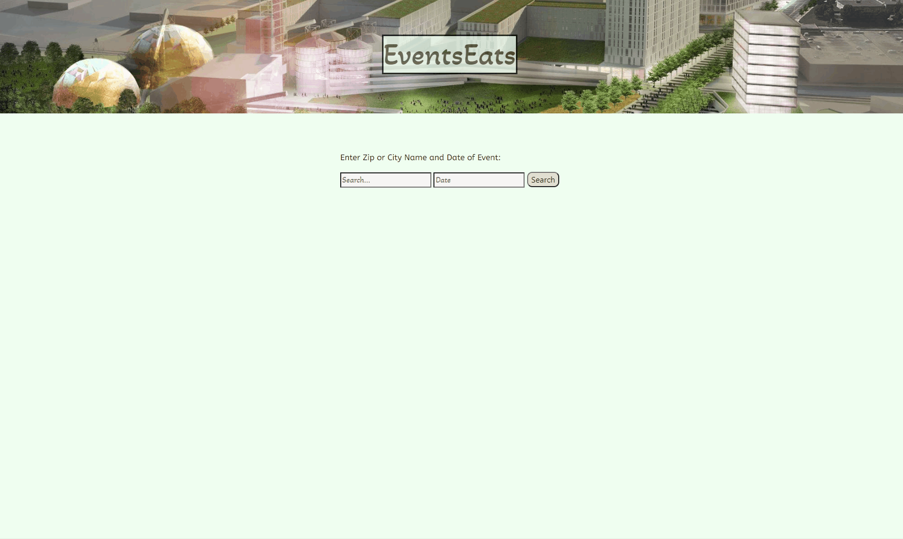

# Events Eats

This application will allow users to plan a trip by choosing an event they plan to attend. Clicking on that event will display resturaunts within a 5 mile radius of that event.

[Events Eats](https://schimmoellerm.github.io/events-eats/)
## Instructions

1. User will be presented with a city search input and a date picker widget.
2. Inputing a city and choosing a date will display cards with the names of events coming up.
3. A JQuery UI dialog box will pop up if incorrect data is input.
4. The user can pull the next 10 events or view the previous 10 events.
5. Clicking one of these events will display five resturaunts within a 5 mile radius.
6. The user can choose to index to the next five or go back to the previous five. 
7. If the user clicks the title at the top of the page it will refresh the page.

## Built With

* [Ticketmaster API](https://developer.ticketmaster.com/products-and-docs/apis/getting-started/) -Ticketmaster API used to find events at a location
* [DocuMenu API](https://documenu.com/dashboard) -DocuMenu API for searching for resturaunts around that location
* [bootstrap](https://getbootstrap.com/) - Front end framework library for HTML and CSS.
* [jQuery](https://jquery.com/) - JS library that simplifies JS and HTML interactions.
* [Google Fonts](https://fonts.gooogle.com) - Google library of fonts.
* [VSCode](https://code.visualstudio.com/) - Code editing software
* [GitBash](https://gitforwindows.org/) - Command line interface

## Authors

* **Michael O'Connor** - *Programmer* - [oconnor97](https://github.com/oconnor97)
* **William (Corey) Farnsworth** - *Programmer* - [Cynwise](https://github.com/Cynwise)
* **LaRonda Heimberger** - *Programmer* - [RondaH](https://github.com/RondaH)
* **Mitch Schimmoeller** - *Programmer* - [Schimmoellerm](https://github.com/Schimmoellerm)

## Acknowledgments

* The OSU coding boot camp, its Instructor and TAs who fielded questions regarding this project.
